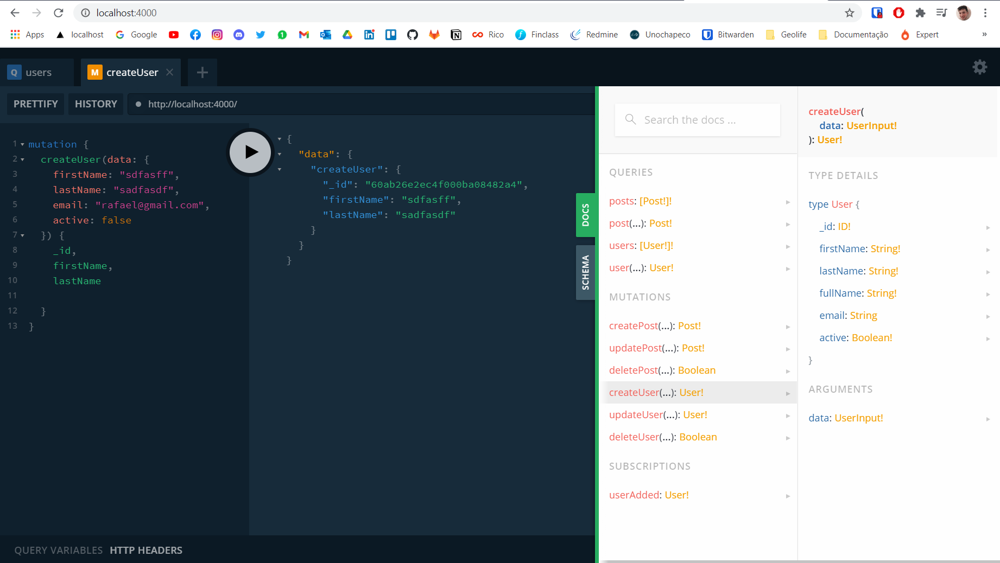
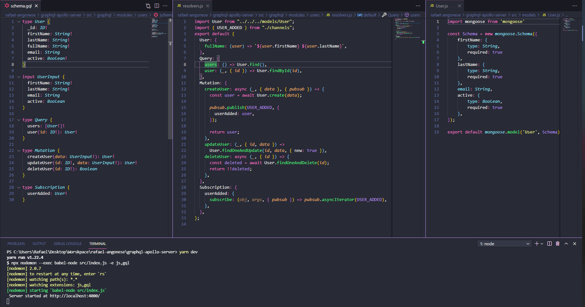

<p align="center">
  
</p>

<p align="center">
  
</p>

<p align="center">

</p>

## ✨ Tecnologias

Esse projeto foi desenvolvido com as seguintes tecnologias:

- [Graphql](https://graphql.org/)
- [Apollo Graphql](https://www.apollographql.com/)
- [Mongodb](https://www.mongodb.com/)

## 💻 Projeto

Este projeto é um API em Graphql, ele tem como objetivo aplicar de forma pratica o uso de Graphql

  ## Ambiente de desenvolvimento

```bash
node --version
v16.0.0

yarn --version
1.22.4
```

## 🚀 Como executar

- Clone o repositório
- Instale as dependências com `yarn`
- Inicie o servidor com `yarn dev`
- Ou
- Inicie o servidor com `yarn dev-old`

A aplicação pode ser acessada em [`localhost:4000`](http://localhost:4000).

## 📄 Licença

Esse projeto está sob a licença MIT. Veja o arquivo [LICENSE](LICENSE.md) para mais detalhes.

---

Feito com ♥ by Rafael Angonese
